# 1. Introduction

## 1.1 Purpose

This document specifies GeoE3 — the Geospatial Enabling Environments for Employment
spatial tool: a QGIS plugin, developed by Kartoza for and with the World Bank, that
measures how enabling places are for employment and entrepreneurship, with particular
attention to the barriers that affect women's economic empowerment. The plugin scores a
study area on a regular analysis grid across three dimensions — Contextual,
Accessibility and Place Characterization — and aggregates the results into a single
GeoE3 enablement score (0–5), together with population-weighted, opportunity-masked and
subnational roll-up products. The specification is written from the working software
(reverse-engineered from plugin version 2.1.0) and is intended to be sufficient to
rebuild a homologous application on another platform.

## 1.2 Scope

In scope:

- A guided project workflow inside QGIS: study area definition, analysis grid
  generation (square or H3 hexagon), data-source configuration per indicator, weighted
  aggregation, and map/report outputs.
- Seventeen indicator processor types (index scores, per-cell counts, buffers and
  isochrones, raster reclassification, polygon classification, conflict impact) plus
  three aggregation workflows and post-analysis products.
- The `model.json` analysis model: hierarchy, attributes, runtime state, and the
  procedure for extending it.
- A complete catalogue of the shipped model — every dimension, factor and indicator
  with its defaults, and the indicator × processor capability matrix.
- All system outputs: the `study_area.gpkg` schema, the working-directory file layout,
  raster and VRT conventions, styling, reports, and the QGIS layer tree organisation.
- Data acquisition from external services: OpenStreetMap/Overpass, GHSL, Ookla,
  OpenRouteService, Space2Stats, ACLED (user-supplied CSV).
- Data-integrity behaviour, including GeoPackage self-healing.

Out of scope:

- The scientific derivation and validation of the indicator scoring rubrics (owned by
  the World Bank GOST methodology documents).
- QGIS itself, GDAL/OGR, and the external data services' internals.
- Web or server deployments — GeoE3 is a desktop QGIS plugin.

## 1.3 Definitions

| Term | Meaning |
|------|---------|
| Analysis | The root of the model: one scored study over one study area. |
| Dimension | Top aggregation level: Contextual, Accessibility, Place Characterization. |
| Factor | Mid aggregation level inside a dimension (16 shipped factors). |
| Indicator | Leaf analysis unit computing one 0–5 score layer (35+ shipped). |
| Analysis mode | The `use_*` flag on an indicator that selects its processor/workflow. |
| Study area | The user's boundary polygons, processed into grid, masks and metadata. |
| Grid-first | Writing scores into `study_area_grid` columns, then rasterizing. |
| GeoE3 score | The final 0–5 weighted aggregate across the three dimensions. |
| WEE | Women's Economic Empowerment (the analytical framing of the tool). |
| GHSL | Global Human Settlement Layer (settlement extent polygons). |
| ORS | OpenRouteService routing API (optional isochrone provider). |
| S2S | Space2Stats — World Bank zonal-statistics API used at regional scale. |
| Likert scale | The 0–5 enablement scoring convention used for every layer. |

## 1.4 References

- GeoE3 repository — github.com/worldbank/GeoE3 (plugin source, `geest/` package).
- QGIS 3.34 LTR / 3.44 / 4.x API documentation — QgsTask, processing framework, OGR provider.
- GDAL/OGR documentation — GeoPackage driver, VRT format, rasterize/clip algorithms.
- OGC GeoPackage 1.3 specification — rtree spatial index and triggers.
- Kartoza Brand Pack and Brand Templates v1.0.0 — the document system this SRS follows.
- World Bank GOST GEEST methodology — indicator definitions and scoring rubrics.

## 1.5 Background

GeoE3 grew out of the GEEST (Gender Enabling Environments Spatial Tool) project. Its
premise: the same location can be very differently "enabling" for employment depending
on services within reach, infrastructure, safety, hazards and the legal/policy context —
and those differences are sharper for women. The plugin makes that measurable: every
indicator produces a 0–5 raster over a common analysis grid, and a weighted pyramid
aggregates indicators into factors, factors into dimensions, and dimensions into a
single score, so that planners can see where investment would remove the binding
constraints. Analyses run at local (city), national or regional (multi-country, H3)
scale from the same model.

# 2. Product overview

## 2.1 Product perspective

GeoE3 is a Python QGIS plugin (package `geest/`) hosted in the QGIS dock. It leans on
QGIS for rendering, layer management, projections and the processing framework; on
GDAL/OGR for all GeoPackage and raster I/O; and on a set of public data services for
inputs. All state lives in the user's working directory: a `model.json` document (the
analysis configuration and results ledger) and a `study_area.gpkg` GeoPackage (the
geometry and grid database), surrounded by per-indicator raster outputs. There is no
server component; every computation runs inside the QGIS process on background threads.

## 2.2 User classes & personas

| Persona | Goals | Key interactions |
|---------|-------|------------------|
| Analyst (GIS practitioner) | Produce a defensible enablement analysis for a geography. | Create project; configure indicator data sources and weights; run analysis; inspect outputs. |
| GIS administrator | Prepare infrastructure inputs and keep runs reproducible. | Road network preparation, ORS key management, OSM downloads, concurrency settings. |
| Policy maker / economist | Understand where interventions matter. | Browse scored maps, population-weighted products, subnational roll-ups, PDF reports. |
| Plugin developer | Extend the model and processors. | model.json extension, new workflow classes, test suite. |

## 2.3 Use case diagram

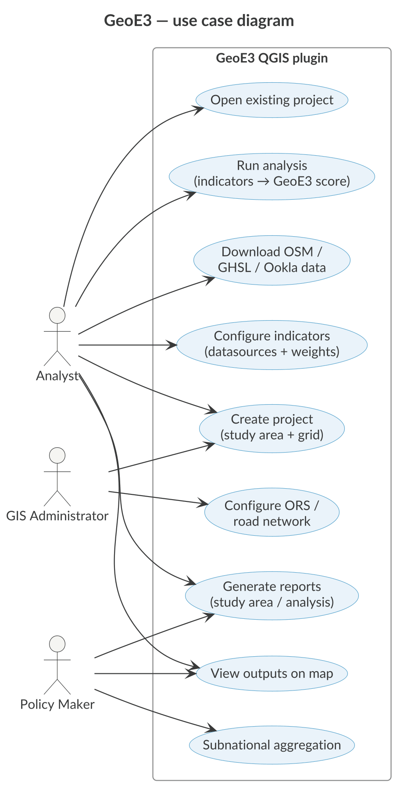

## 2.4 System architecture

The plugin has four architectural layers: a panel-based GUI (a dock hosting ten stacked
panels culminating in the analysis tree), a thread-safe orchestration core (workflow
queue over QgsTask), a library of processors (17 indicator workflows, 3 aggregation
workflows and a set of standalone algorithm tasks), and a persistence layer (the
GeoPackage grid database plus raster/VRT outputs). External data services are consumed
by the processors through dedicated downloader/client classes.

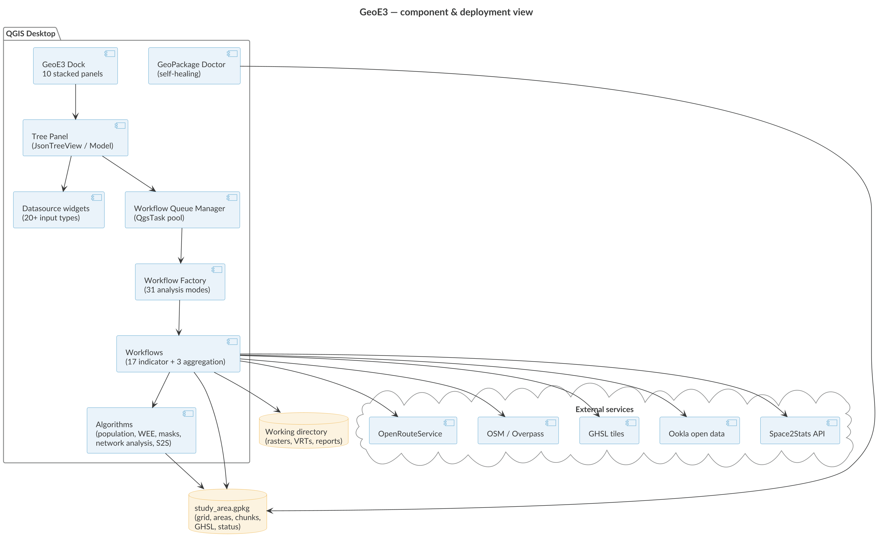

# 3. Software architecture

## 3.1 Plugin lifecycle and GUI

The plugin class registers a dock widget (`GeoE3Dock`) containing a `QStackedWidget` of
ten panels: Intro, Credits, Setup, Open Project, Create Project, S2S prefetch (regional
scale only), ORS, Road Network, Tree (the working surface) and Help. Panels emit
`switch_to_next_tab` / `switch_to_previous_tab` navigation signals; the dock routes
conditionally (for example, the S2S panel only appears for regional projects). The tree
panel owns the analysis model, the workflow queue manager, progress bars and the
message bar used for error surfacing.

## 3.2 Orchestration core

Work is scheduled through three collaborating classes. `WorkflowQueueManager` is the
façade the GUI talks to; it owns a `WorkflowQueue` which manages a pool of concurrent
`WorkflowJob` tasks (pool size follows the `concurrent_tasks` setting, re-read per
batch). Each `WorkflowJob` is a `QgsTask` that asks `WorkflowFactory` to build the
right workflow object for its tree item's `analysis_mode`, then calls `execute()` on
the QGIS task thread. Progress, status and errors flow back to the tree panel over Qt
signals. Tree items (`JsonTreeItem`) are deliberately not QObjects: they are plain,
lock-protected objects shared by reference between the GUI and worker threads, so a
workflow's writes are immediately visible in the tree.

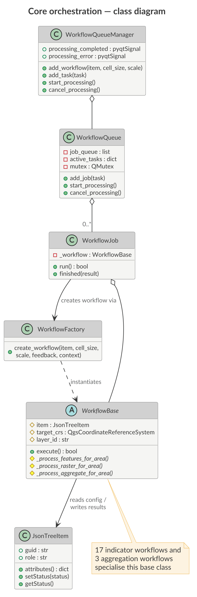

## 3.3 The analysis model tree

`model.json` is deserialised into a `JsonTreeItem` tree exposed through `JsonTreeModel`
(Qt model/view) and rendered by `JsonTreeView` with status icons, weights and context
menus. The hierarchy is fixed: one analysis root, three dimensions, factors, and
indicator leaves. Every item carries a `guid`, its configuration attributes and its
runtime results; the tree is serialised back to `model.json` after every edit and
workflow completion.

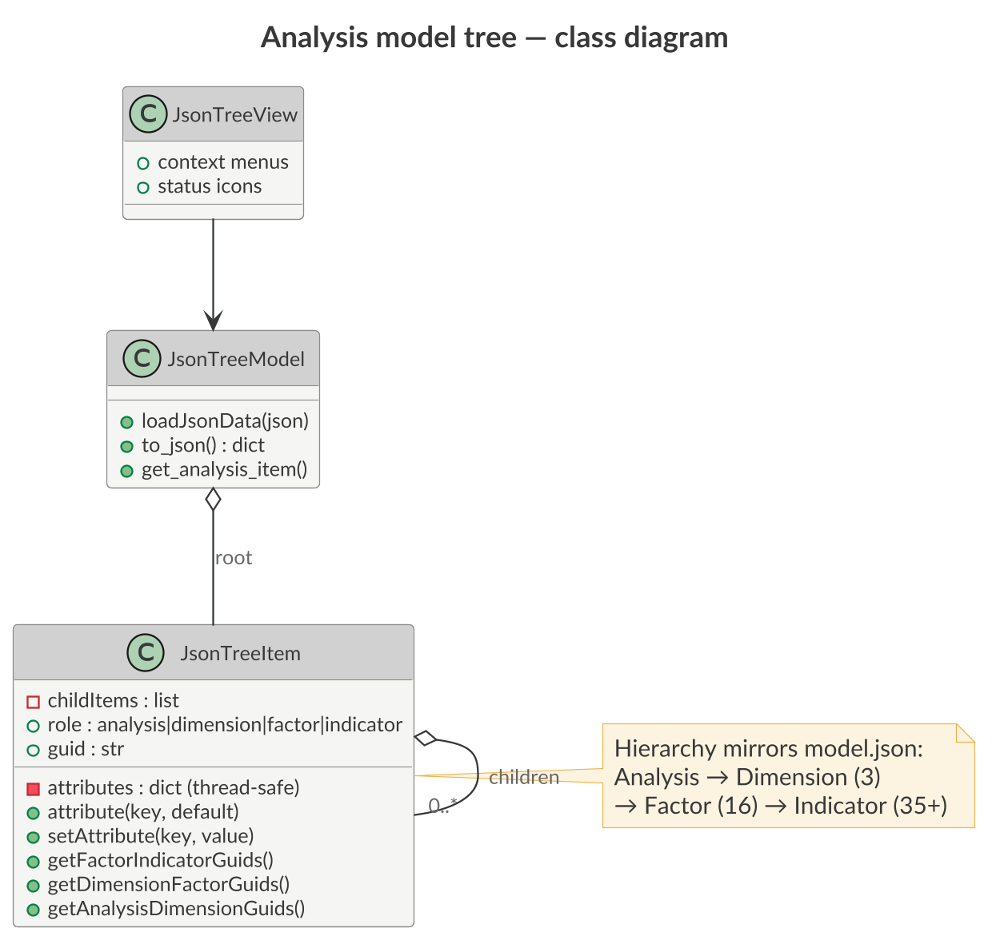

## 3.4 Subsystem inventory

| Module (under `geest/`) | Responsibility |
|--------------------------|----------------|
| `core/workflow_queue_manager.py`, `workflow_queue.py`, `workflow_job.py` | Task orchestration over QgsTask with dynamic concurrency. |
| `core/workflow_factory.py` | `analysis_mode` → workflow class dispatch (31 modes). |
| `core/workflows/` | 17 indicator + 3 aggregation workflow classes over `WorkflowBase`. |
| `core/algorithms/` | Standalone processors: population, WEE×population, opportunity masks, subnational aggregation, per-cell feature counting, native network analysis, GHSL/Ookla downloaders. |
| `core/tasks/` | Study area creation (grid, chunks, masks), grid chunker, OSM downloader tasks, report tasks. |
| `core/grid_column_utils.py` | All grid-column writing/rasterizing primitives (SQL-first, WAL-safe). |
| `core/gpkg_doctor.py` | GeoPackage health checks and in-place self-healing. |
| `core/json_tree_item.py`, `gui/views/` | Model tree, Qt model/view binding. |
| `gui/panels/` | The ten dock panels. |
| `gui/widgets/datasource_widgets/` | 20+ input widgets, one per analysis mode. |
| `gui/dialogs/` | Factor/dimension/analysis aggregation (weight) dialogs. |
| `core/reports/` | Study area and analysis PDF report generation. |
| `core/ors_client.py`, `s2s_client.py`, `osm_downloaders/` | External service clients. |
| `core/settings.py`, `i18n.py`, `utilities.py` | Settings, translations, helpers. |

## 3.5 Data integrity and self-healing

All GeoPackage writes use WAL journalling with `synchronous=NORMAL`, explicit WAL
checkpoints on writer shutdown, and a single-writer thread during study area creation.
A dedicated doctor module verifies the GeoPackage on project open, after every workflow
batch and at the end of study area creation, repairing in place where possible: stale
WAL journals are checkpointed; duplicated schema objects (the historic
"trigger already exists" corruption) are byte-renamed and removed without copying the
file; structural btree damage triggers a `VACUUM INTO` rebuild with an atomic swap,
preserving the corrupt original as a timestamped `.bak`.

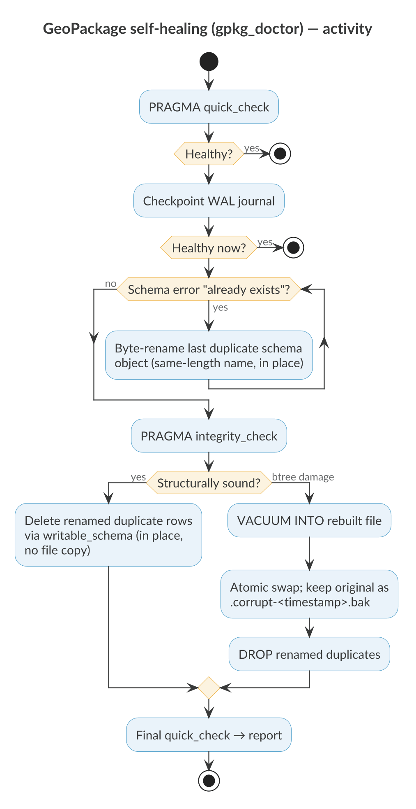

# 4. Functional requirements

## 4.1 Project setup & study area

| ID | Requirement |
|----|-------------|
| FR-001 | **(MUST)** The user can create a project from a polygon boundary layer and a name field, choosing analysis scale (local, national, regional), a working directory, and cell size (metres) or H3 resolution (regional). |
| FR-002 | **(MUST)** The CRS is the boundary layer CRS when projected, else a UTM zone computed from the study area centroid; every output uses this single CRS. |
| FR-003 | **(MUST)** Study area creation runs as a cancellable background task with live progress, producing `study_area.gpkg` (bboxes, polygons, clip polygons, grid, chunks, status) and per-area raster masks combined into a VRT. |
| FR-004 | **(MUST)** Grid generation tiles each boundary geometry into chunks and generates square cells (national/local) or H3 hexagons (regional), clipped to the boundary, through a single writer thread. |
| FR-005 | **(MUST)** GHSL settlement data is downloaded and polygonised automatically; on failure the user chooses to continue without it or abort. |
| FR-006 | **(SHOULD)** Regional projects offer Space2Stats prefetch (chunked, retried) to cache remote datasets before analysis. |
| FR-007 | **(MUST)** Existing projects reopen from `model.json`; incomplete study areas prompt for regeneration. |
| FR-008 | **(SHOULD)** A study area PDF report is generated automatically after creation. |

## 4.2 Configuration

| ID | Requirement |
|----|-------------|
| FR-020 | **(MUST)** The analysis is presented as a tree (analysis → dimensions → factors → indicators) with status icons, weights and context menus. |
| FR-021 | **(MUST)** Each indicator's data source is configured through a widget matched to its analysis mode (layer+field, point/line/polygon layer, raster, CSV, ACLED CSV, fixed value, S2S dataset, OSM download, index score variants). |
| FR-022 | **(MUST)** Weights are editable at every level; enabled siblings must sum to 1.0 (validated live, with an auto-balance action) before the dialog can be accepted. |
| FR-023 | **(MUST)** Indicators/factors can be disabled (weight 0 or "Do Not Use") and are then excluded from aggregation and marked in the tree. |
| FR-024 | **(MUST)** Women-considerations toggling shows/hides women-specific factors (`women_enabling`=1) and swaps in EPLEX (`women_enabling`=2) when disabled. |
| FR-025 | **(MUST)** Every configuration edit persists immediately to the project's `model.json`; changing a datasource clears that indicator's results. |
| FR-026 | **(SHOULD)** OSM data for supported indicators can be downloaded from the dialog for the study area extent. |
| FR-027 | **(MUST)** Accessibility routing uses either QGIS native network analysis over a user-supplied road network or the OpenRouteService API with a validated key. |

## 4.3 Analysis execution

| ID | Requirement |
|----|-------------|
| FR-040 | **(MUST)** The user can run everything, only incomplete items, or a single item (shift-run forces recomputation of completed children). |
| FR-041 | **(MUST)** Execution proceeds in strict stages — all indicators, then factors, then dimensions, then the analysis — so aggregation never reads incomplete inputs. |
| FR-042 | **(MUST)** Workflows run as queued QgsTasks with configurable concurrency; the UI never blocks and shows overall + per-task progress. |
| FR-043 | **(MUST)** Every indicator writes a 0–5 score into its `study_area_grid` column and rasterizes it per area; VRTs mosaic areas into one layer with QML styling. |
| FR-044 | **(MUST)** Failures mark the item with an error icon, persist the message and error file, notify via the message bar, and do not halt the remaining queue. |
| FR-045 | **(MUST)** Aggregation computes weighted sums per grid cell: `fac_* = Σ w·indicator`, `dim_* = Σ w·factor`, `geoe3 = Σ w·dimension`. |
| FR-046 | **(MUST)** After analysis, insight products are computed: GeoE3 × population (15-class bivariate), opportunities mask, GHSL-masked variants, and optional subnational aggregation. |
| FR-047 | **(SHOULD)** Completed results are added to the QGIS map automatically in the GeoE3 layer-tree group hierarchy. |

## 4.4 Outputs, reports & integrity

| ID | Requirement |
|----|-------------|
| FR-060 | **(MUST)** All rasters are Float32, 0–5 (or 1–15 bivariate), nodata −9999/255, aligned to the analysis grid, in the study CRS. |
| FR-061 | **(MUST)** The working directory mirrors the model hierarchy (dimension/factor/indicator folders) with predictable file naming (see §9). |
| FR-062 | **(MUST)** Study area and analysis reports are generated as PDF from bundled QGIS print templates. |
| FR-063 | **(MUST)** The GeoPackage is health-checked on project open, after workflow batches and after study area creation, and self-healed in place when corruption is detected; unrecoverable files are preserved and reported. |
| FR-064 | **(MUST)** A corrupt original is never deleted: rebuilds keep a `.corrupt-<timestamp>.bak` alongside the repaired file. |
| FR-065 | **(SHOULD)** All user-visible strings are translatable (Qt i18n). |

# 5. Processing phases

## 5.1 Project setup phase

The panel flow gathers everything needed before analysis: boundary + field, scale and
resolution, working directory, CRS strategy, women-considerations toggle, optional S2S
prefetch, routing provider and road network. Validation happens at each step (layer
validity, H3 cell-count guardrails, ORS key check, CRS matching).

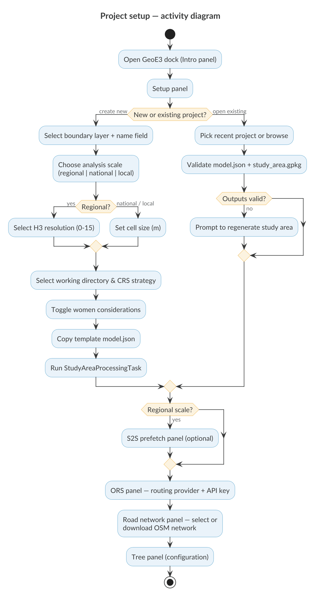

## 5.2 Study area creation phase

`StudyAreaProcessingTask` transforms the boundary layer into the analysis database. It
is the heaviest write phase and runs through a single unified writer thread with WAL
journalling; per-geometry timing and completion flags are recorded in
`study_area_creation_status`, and the phase ends with a GeoPackage health verification.

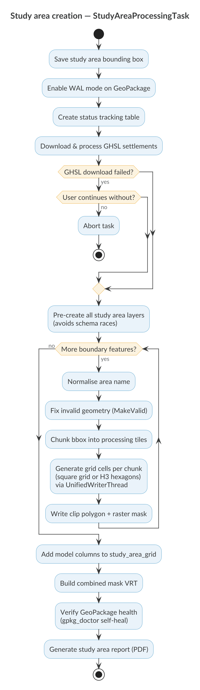

## 5.3 Analysis execution phase

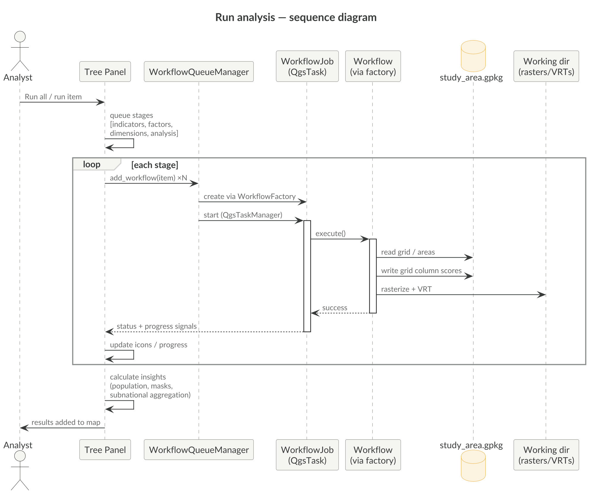

Item lifecycle during execution:

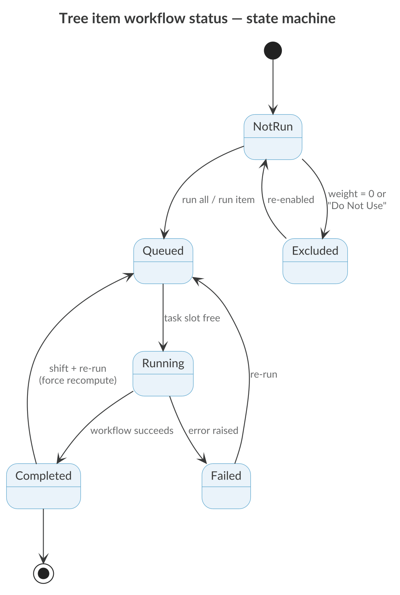

## 5.4 Aggregation pyramid

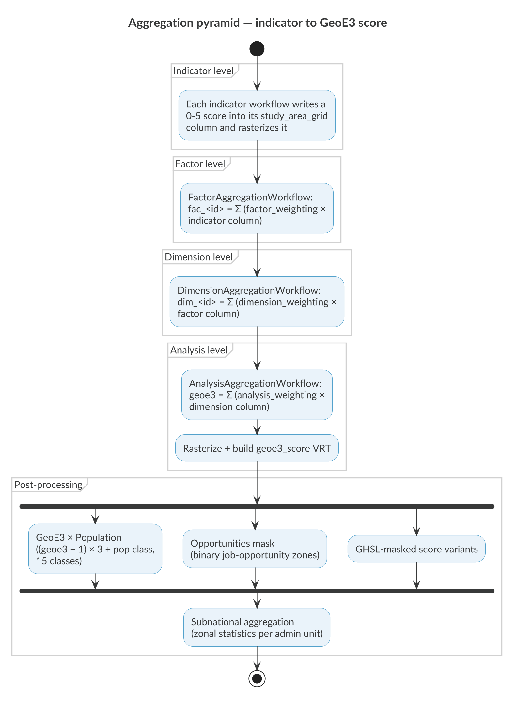

# 6. Processor reference

Every indicator carries an `analysis_mode`; `WorkflowFactory` maps it to a workflow
class. All workflows share `WorkflowBase` behaviour: study-area layers and target CRS
resolution (with metadata fallback and self-heal retry), per-area iteration, grid-first
score writing through `grid_column_utils`, rasterization (`<layer_id>_<n>.tif`), VRT
assembly, QML styling, and result/status attributes written back to the tree item.

## 6.1 Index score processors

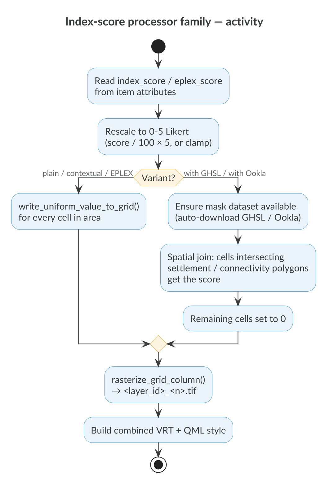

### 6.1.1 DefaultIndexScoreWorkflow (`use_index_score`)

Writes a single national/subnational index value (0–100, rescaled ×5/100) uniformly to
every grid cell in each area. Used where no spatial differentiation exists (e.g. legal
indices). Inputs: `index_score` attribute. Outputs: uniform grid column + raster.

### 6.1.2 ContextualIndexScoreWorkflow (`use_contextual_index_score`)

As above, but the score maps through the contextual threshold table (Women, Business
and the Law indices → Likert bands) rather than linear rescaling. Used by Workplace
Discrimination, Regulatory Frameworks and Financial Inclusion factors.

### 6.1.3 EPLEXWorkflow (`use_eplex_score`)

Fills the study area with the OECD Employment Protection Legislation score, normalised
into 0–5. Active when women considerations are disabled (`women_enabling`=2 swap).

### 6.1.4 IndexScoreWithGHSLWorkflow (`use_index_score_with_ghsl`)

Applies the index score only to grid cells intersecting GHSL settlement polygons
(auto-downloaded when missing); non-settlement cells score 0. Used by the Education
factor at national scale.

### 6.1.5 IndexScoreWithOoklaWorkflow (`use_index_score_with_ookla`)

Applies the internet-usage index only to cells covered by Ookla open-data broadband /
mobile tiles (downloaded and merged into `ookla_combined.gpkg`). Used by Digital
Inclusion.

## 6.2 Per-cell feature processors

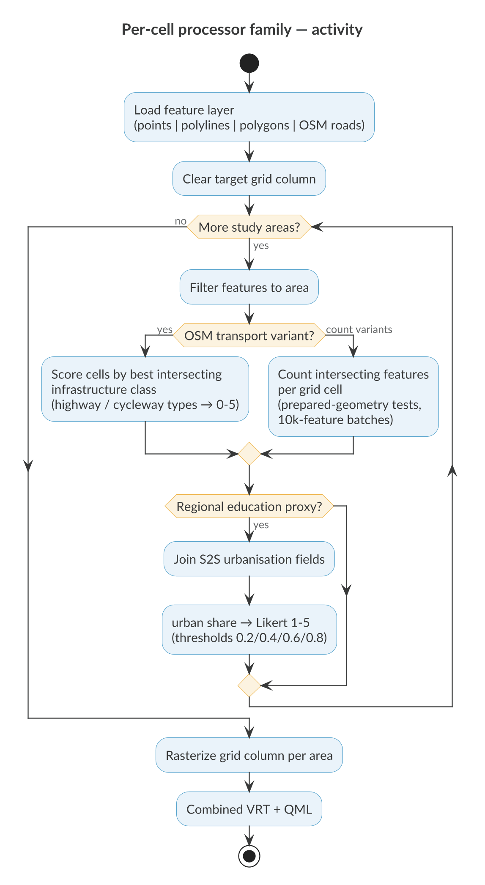

### 6.2.1 PointPerCellWorkflow (`use_point_per_cell`) and PolylinePerCellWorkflow (`use_polyline_per_cell`)

Count point/line features intersecting each cell into the grid column, then rescale to
0–5. Batched writes (10 000 features) with prepared geometries keep national grids
tractable.

### 6.2.2 PolygonPerCellWorkflow (`use_polygon_per_cell`)

Counts polygons per cell. At regional scale, the Education indicator switches to the
S2S urbanisation proxy: GHS population fields are joined per H3 cell and the urban
share `(ghs_22+ghs_23+ghs_30)/total` is classified to Likert 1–5 at thresholds
0.2/0.4/0.6/0.8.

### 6.2.3 OsmTransportPolylinePerCellWorkflow (`use_osm_transport_polyline_per_cell`)

Scores active-transport quality per cell from the OSM road network: each cell receives
the best score among intersecting infrastructure classes (dedicated cycleways score
higher than shared roads; highway classes map through a scoring table).

## 6.3 Buffer & isochrone processors

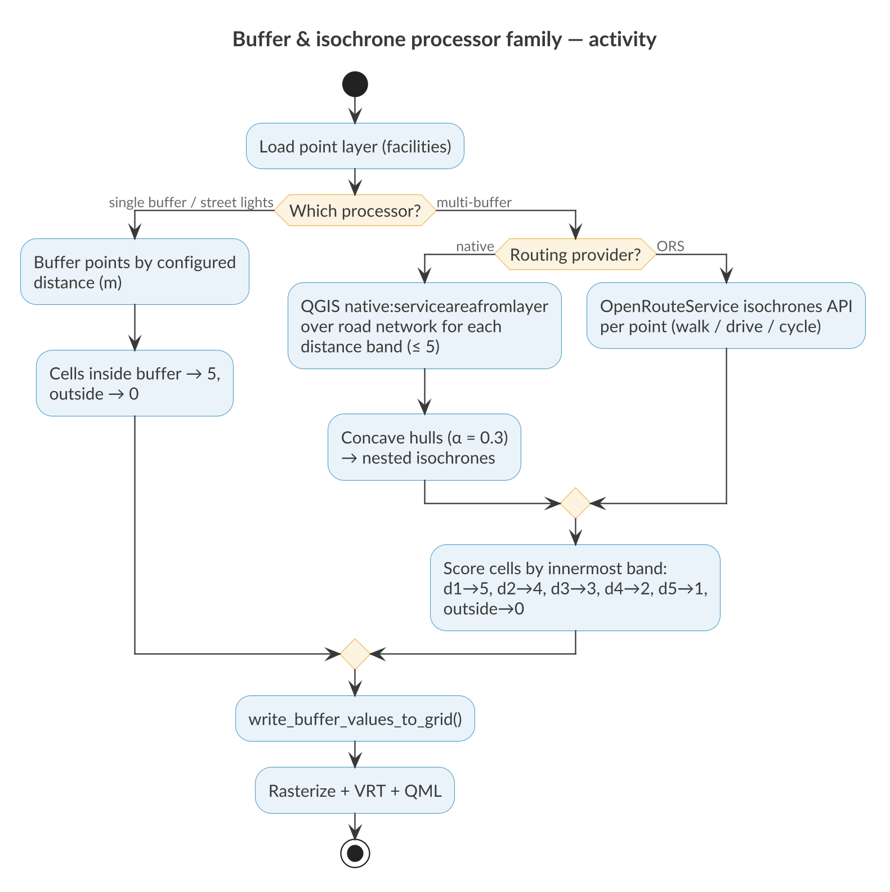

### 6.3.1 SinglePointBufferWorkflow (`use_single_buffer_point`)

Buffers facility points by one configured distance; cells inside any buffer score 5,
outside 0. Used for water/sanitation facilities and similar.

### 6.3.2 MultiBufferDistancesNativeWorkflow (`use_multi_buffer_point`, default)

Network-based service areas: for up to five distance bands (e.g. 400/800/1200/1500/2000 m),
QGIS `native:serviceareafromlayer` runs over the prepared road network, concave hulls
(α = 0.3) form nested isochrones, and cells score 5 (innermost) down to 1 (outermost),
0 beyond. Powers the Women's Travel Patterns, transport, health, education and finance
accessibility factors.

### 6.3.3 MultiBufferDistancesORSWorkflow (`use_multi_buffer_point` + ORS enabled)

The same scoring driven by OpenRouteService isochrones (walk/drive/cycle) instead of
local network analysis; requires a validated API key and respects rate limits.

### 6.3.4 StreetLightsBufferWorkflow (`use_street_lights`)

Buffers street-light points by an illumination radius and scores covered cells —
a proxy for perceived night-time safety at local scale.

## 6.4 Raster processors

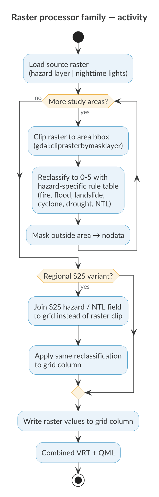

### 6.4.1 RasterReclassificationWorkflow (`use_environmental_hazards`)

Reclassifies hazard rasters into enablement scores with per-hazard tables — fire (WRI
index bands), flood (inundation days), landslide (susceptibility classes 0–5 inverted),
tropical cyclone (return periods), drought. One indicator per hazard under the
Environmental Hazards factor.

### 6.4.2 SafetyRasterWorkflow (`use_nighttime_lights`)

Reclassifies VIIRS-style nighttime-lights radiance into safety scores (brighter →
safer). At regional scale it can instead join the prefetched S2S NTL field per cell.

## 6.5 Polygon classification processors

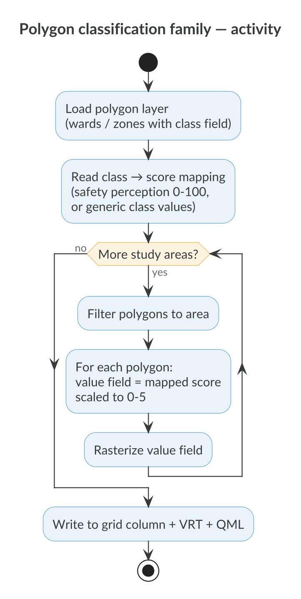

### 6.5.1 ClassifiedPolygonWorkflow (`use_classify_polygon_into_classes`) and SafetyPolygonWorkflow (`use_classify_safety_polygon_into_classes`)

Map a categorical attribute on user polygons (e.g. perceived-safety survey wards)
through a user-editable value→score table (0–100, scaled to 0–5) and rasterize.

## 6.6 Conflict impact processor

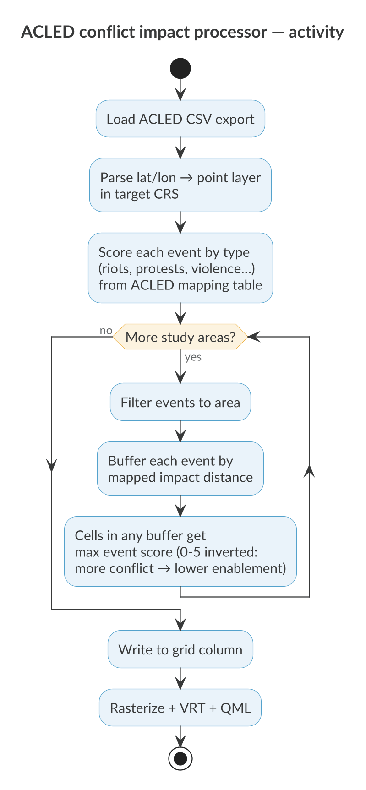

### 6.6.1 AcledImpactWorkflow (`use_csv_to_point_layer`)

Ingests an ACLED CSV export, builds a scored point layer (event type → severity,
default 5 km impact buffers) and writes the inverse-enablement score for the FCV
(Fragility, Conflict & Violence) factor.

## 6.7 Aggregation workflows

`FactorAggregationWorkflow`, `DimensionAggregationWorkflow` and
`AnalysisAggregationWorkflow` share `AggregationWorkflowBase`: gather child GUIDs,
verify children completed (skipping excluded ones), compute the weighted sum per grid
cell in SQL, write `fac_<id>` / `dim_<id>` / `geoe3` columns, rasterize and build VRTs.
The analysis level writes into `geoe3_score/` and triggers the insight products.

## 6.8 Standalone processors

| Processor | Purpose |
|-----------|---------|
| PopulationRasterProcessingTask | Clip, sum-resample and tercile-classify a population raster (3 classes) per area, with VRT. |
| WEEByPopulationScoreProcessingTask | Bivariate 15-class GeoE3 × population product `((geoe3−1)×3)+pop`. |
| OpportunitiesMaskProcessor | Binary opportunity mask from points (buffered), polygons, rasters or GHSL. |
| SubnationalAggregationProcessingTask | Zonal majority/mean of the score products per admin polygon into styled GeoPackages. |
| NativeNetworkAnalysisProcessingTask | Batch isochrone engine behind the native multi-buffer workflow. |
| GHSLDownloader / GHSLProcessor | Tile discovery, download, reclassify, polygonise settlements into the GeoPackage. |
| OoklaDownloader | Fetch and merge Ookla open broadband tiles. |
| OSM downloader tasks | 9+ themed Overpass extracts (education, health, groceries, pharmacies, transport, green space, financial, kindergarten, water points). |

# 7. The model.json specification

`model.json` is both the shipped analysis template (`geest/resources/model.json`) and
the per-project working state. The tree panel loads it into the item tree, every edit
and workflow completion writes it back, so the file is a complete, replayable record of
an analysis.

## 7.1 Hierarchy

One JSON document: analysis attributes at the top level, a `dimensions` array of three
dimensions, each with a `factors` array, each factor with an `indicators` array. The
shipped model carries 3 dimensions, 16 factors and 35+ indicators.

## 7.2 Analysis-level attributes

| Attribute | Type | Meaning | Written by |
|-----------|------|---------|------------|
| `analysis_name`, `description` | string | Title and notes. | Runtime (user). |
| `working_folder` | string | Project directory (outputs root). | Runtime. |
| `analysis_cell_size_m` | number | Grid cell size in metres. | Runtime (setup). |
| `analysis_scale` | string | `local` \| `national` \| `regional`. | Runtime (setup). |
| `analysis_h3_resolution` | int | H3 resolution (regional only). | Runtime (setup). |
| `women_considerations_enabled` | bool | Toggles women-specific factors / EPLEX swap. | Runtime. |
| `admin_boundary_layer_source` | string | Input boundary layer URI. | Runtime. |
| `road_network_layer_path` | string | Network for isochrone routing. | Runtime. |
| `qgis_project_path` | string | Associated .qgz to reopen. | Runtime. |
| `population_layer_source`, `aggregation_polygon_layer_source` | string | Post-analysis inputs. | Runtime. |
| `mask_mode`, `buffer_distance_m`, `*_mask_*` | various | Opportunity-mask configuration. | Runtime. |
| `output_filename` | string | Final score base name (`GeoE3_Score`). | Shipped. |
| `guid`, `result`, `result_file`, `error`, `error_file`, `execution_start_time`, `execution_end_time` | string | Identity and execution ledger. | Runtime. |

## 7.3 Dimension and factor attributes

Dimensions carry `id`, `name`, `output_filename`, `description`,
`default_analysis_weighting` / `analysis_weighting` (their weight in the final score)
and their `factors`. Factors carry the analogous `default_dimension_weighting` /
`dimension_weighting`, their `indicators`, and `women_enabling`: 0 = always shown,
1 = shown only when women considerations are on, 2 = shown only when they are off
(the EPLEX swap). Both levels gain `guid`, `analysis_mode`
(`dimension_aggregation` / `factor_aggregation`), `result`, `result_file` and execution
timestamps at runtime.

## 7.4 Indicator attributes

| Group | Attributes |
|-------|-----------|
| Identity | `indicator` (label), `id`, `output_filename`, `description`, `guid`. |
| Weighting | `default_factor_weighting`, `factor_weighting` (0 disables). |
| Mode selection | Exactly one `use_*` flag set to 1 (17 flags — see §6); `analysis_mode` holds the active flag name or `Do Not Use`. |
| Mode parameters | `default_multi_buffer_distances` (CSV metres), `default_single_buffer_distance`, `index_score`, `eplex_score`, `s2s_fields`, `osm_download_enabled`. |
| Runtime datasource | `{mode}_layer_source` \| `{mode}_shapefile` \| `{mode}_raster` \| `{mode}_csv_file`, plus field selections captured by the datasource widget. |
| Execution ledger | `result`, `result_file`, `error`, `error_file`, `execution_start_time`, `execution_end_time`. |

## 7.5 Shipped model summary

| Dimension (weight) | Factors → indicators |
|--------------------|----------------------|
| Contextual (0.10) | EPLEX (women_enabling 2); Workplace Discrimination; Regulatory Frameworks; Financial Inclusion — each one WBL/EPLEX index indicator. |
| Accessibility (0.45) | Women's Travel Patterns (kindergartens, primary schools, groceries, pharmacies, green spaces); Public Transport; Health Facilities; Education & Training; Financial Facilities — all multi-buffer isochrone indicators. |
| Place Characterization (0.45) | Active Transport (OSM network); Safety Perception (nighttime lights / street lights); FCV (ACLED); Education (index + GHSL); Digital Inclusion (index + Ookla); Environmental Hazards (fire, flood, landslide, cyclone, drought); Water & Sanitation (single buffer). |

Chapter 8 is the full catalogue: it enumerates every dimension, factor and
indicator of the shipped model with its defaults, and maps each indicator to the
processors that can run it.

## 7.6 Validation and generation

`generate_schema.py` infers a JSON schema (`resources/schema.json`) from the shipped
model and `JSONValidator` checks structure on load. Validation is structural only: it
does not enforce that exactly one `use_*` flag is active — the GUI maintains that
invariant. `generate_model.py` can regenerate the shipped model from a curated ODS
spreadsheet (dimension/factor/indicator rows), initialising all indicators to
`Do Not Use`.

## 7.7 Extending the model

1. **New indicator (existing processor):** add an indicator object to the target
   factor's `indicators` in `resources/model.json` with identity fields, default
   weighting, one `use_*` flag set and its mode parameters; rebalance the factor's
   default weights to sum to 1.0; regenerate the schema. No code changes.
2. **New factor / dimension:** add the object with identity, `women_enabling`
   (factors), default weighting (rebalance siblings) and its children; aggregation is
   generic, so no code changes.
3. **New processor type:** implement a `WorkflowBase` subclass in
   `geest/core/workflows/`, register the new `use_*` mode in
   `WorkflowFactory.create_workflow()`, add a datasource widget (and register it in the
   widget factory), then reference the new flag from indicators. Ship tests with the
   workflow.
4. **Migration:** existing project `model.json` files lack new attributes; loaders
   treat missing fields as defaults. For breaking changes, add a `model_version` field
   and a load-time migration step (recommended forward practice).

<!-- pagebreak -->

<!-- include: generated/model-catalogue.md -->

# 9. System outputs

## 9.1 The study area GeoPackage

`<working_folder>/study_area/study_area.gpkg` is the central database. All layers share
the analysis CRS (boundary CRS or auto-selected UTM zone). RTree spatial indexes and
feature-count triggers follow the GeoPackage specification; writes use WAL journalling.

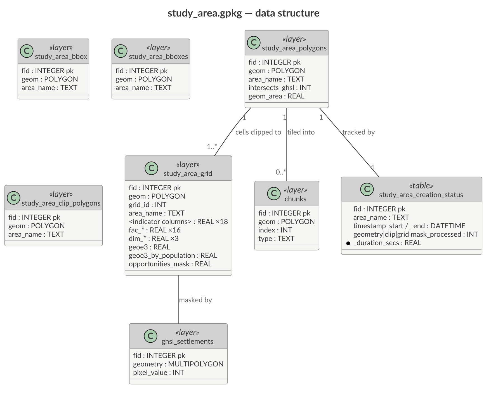

The grid (`study_area_grid`) is the analytical heart: one row per cell (`fid`,
`grid_id`, `area_name`, `geom`) plus one REAL column per indicator (e.g.
`kindergartens_location`), per factor (`fac_*`), per dimension (`dim_*`) and the final
products (`geoe3`, `geoe3_by_population`, masked variants, `opportunities_mask`).
Columns are created from the model at study-area time and lazily on demand; names are
sanitised (lowercase, underscores, ≤ 63 chars).

## 9.2 Working directory layout

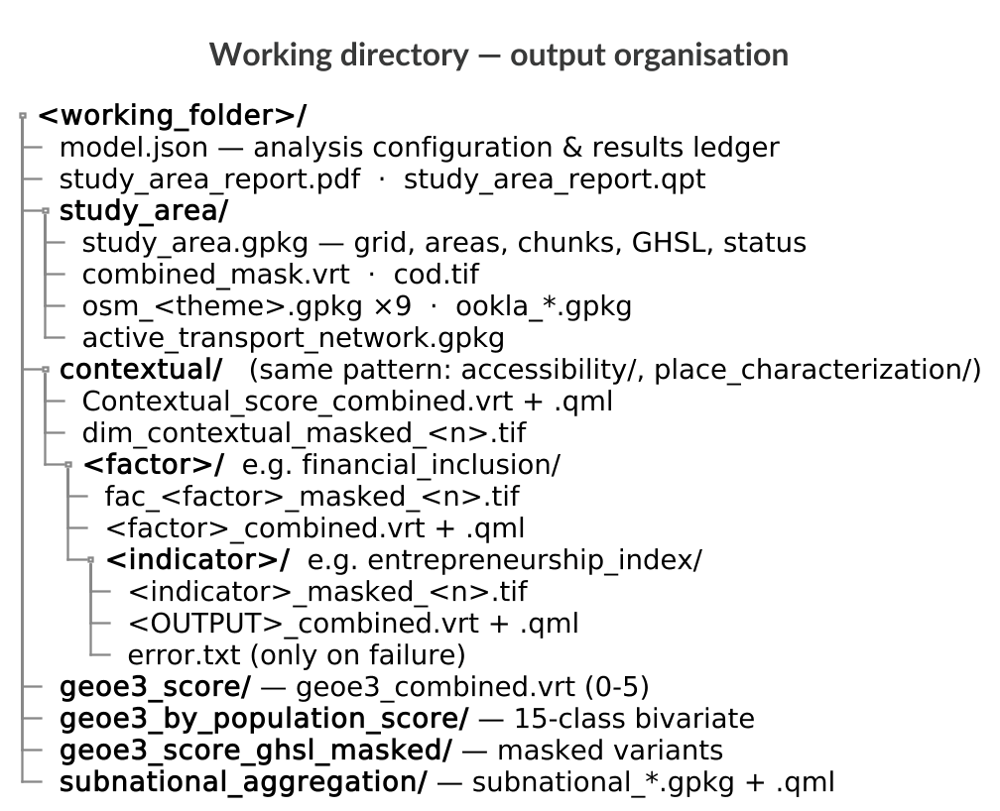

Naming conventions:

| Artefact | Pattern | Example |
|----------|---------|---------|
| Indicator raster (per area) | `<indicator_id>_masked_<n>.tif` | `entrepreneurship_index_masked_0.tif` |
| Factor / dimension raster | `fac_<id>_masked_<n>.tif`, `dim_<id>_masked_<n>.tif` | `fac_financial_inclusion_masked_0.tif` |
| Combined mosaic | `<OUTPUT>_combined.vrt` (+ matching `.qml`) | `FIN_output_combined.vrt` |
| Final score | `geoe3_score/geoe3_combined.vrt` | 0–5 |
| Bivariate product | `geoe3_by_population_score/…​.vrt` | 1–15 |
| Subnational roll-up | `subnational_aggregation/subnational_*.gpkg` | majority class per admin unit |
| Reports | `study_area_report.pdf` (+ `.qpt` template) | |
| Diagnostics | `error.txt` per failed indicator folder; `osm_download_error.txt` | |

## 9.3 Raster conventions

Float32 GeoTIFFs, LZW-compressed and tiled, aligned to the grid origin at the analysis
cell size, nodata −9999 (255 in some VRT bands), values 0–5 (1–15 for the bivariate
product). Every mosaic ships a QML with the standard discrete legend: 0–1 very low
(#d7191c), 1–2 low (#fdae61), 2–3 moderate (#ffffbf), 3–4 enabling (#bce1b8), 4–5
highly enabling (#2c7bb6); the bivariate product uses the 5×3 blended scheme. GDAL
`.aux.xml` sidecars persist statistics.

## 9.4 Map and report products

Results are added under a mutually-exclusive `GeoE3` layer-tree group mirroring the
model hierarchy (study area layers, per-dimension groups with factor/indicator
children, final score groups, subnational aggregates). Two PDF reports are produced
from bundled QGIS print templates: the study area report (created automatically after
setup) and the analysis report (on demand from the tree).

# 10. Non-functional requirements

| ID | Requirement |
|----|-------------|
| NFR-001 | **(MUST)** The UI thread never blocks: all heavy work runs in QgsTask background threads with progress and cancellation. |
| NFR-002 | **(MUST)** A national analysis (~80 000 cells) completes on a workstation; grid writes are batched SQL (10 k+ rows per transaction). |
| NFR-003 | **(MUST)** Concurrency is user-configurable (`concurrent_tasks`); correctness does not depend on the setting. |
| NFR-004 | **(MUST)** All GeoPackage writes are WAL-journalled and checkpointed; SQLite file locking is never disabled (`SQLITE_USE_OGR_VFS` off). |
| NFR-005 | **(MUST)** Corruption is detected within one health-check cycle and repaired without data loss where structurally possible; originals are preserved. |
| NFR-006 | **(MUST)** The plugin supports QGIS 3.34 LTR through 4.x (Qt5 and Qt6). |
| NFR-007 | **(SHOULD)** Re-running an analysis is idempotent: completed items are skipped unless a forced re-run is requested. |
| NFR-008 | **(SHOULD)** External-service failures degrade gracefully (retries, user prompts, error files) and never corrupt local state. |
| NFR-009 | **(SHOULD)** All strings are i18n-wrapped; layouts respect translated lengths. |
| NFR-010 | **(MAY)** Developer aids (profiling, debugpy, foreground execution via `GEOE3_DEBUG`) are available but off by default. |

# 11. Testing & documentation requirements

- **Unit and integration tests** live in `test/` and run inside the official QGIS
  docker images (3.34 LTR and 4.x master) via `scripts/run-docker-tests.sh`; the suite
  gates releases (200+ tests).
- Every new processor ships with a test exercising its scoring path on a small
  fixture; grid utilities and the GeoPackage doctor have dedicated suites.
- **Documentation**: the mkdocs site (user, administrator, developer sections) is
  updated with any behavioural change; this SRS is regenerated when the architecture,
  model or outputs change.
- **Releases**: semantic versioning in `geest/metadata.txt` with a Keep-a-Changelog
  `CHANGELOG.md`; the QGIS plugin package is built per release.

# 12. Appendices

## 12.1 Open questions

1. `model_version` and formal migrations for project files (recommended in §7.7).
2. Consolidating the residual multi-connection writes into the unified writer
   (hardening beyond the corruption root-cause fix).
3. S2S dataset coverage guarantees at regional scale (what happens outside coverage).
4. ORS quota handling for very large facility layers.

## 12.2 Provenance

This SRS was reverse-engineered from the GeoE3 plugin source (v2.1.0, July 2026) —
architecture, processors, model, outputs and flows were audited directly from
`geest/` and a reference national analysis (Democratic Republic of Congo working
directory). Diagrams are UML (PlantUML sources in `srs/diagrams/`, also delivered as
individual SVG files).

---

Made with 💗 by [Kartoza](https://kartoza.com) · [Donate!](https://github.com/sponsors/kartoza) · [GitHub](https://github.com/worldbank/GeoE3)
